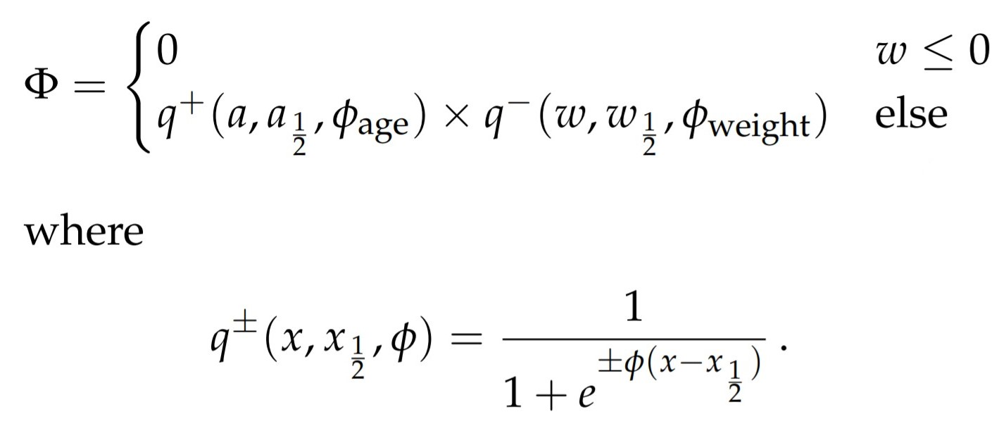
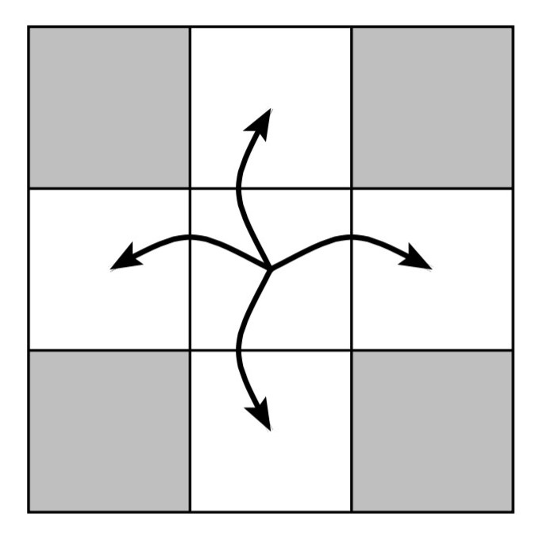

Introduction
==================================

The Ecosystem
----------------------------------

Rossumoya is a small island in the middle of the
vast ocean that belongs to the island nation of Pylandia.
The ecosystem on Rossumoya is relatively
undisturbed, but Pylandia's Environmental Protection Agency wants to study the stability of the ecosystem.
The long term goal is to preserve Rossumoya as
a nature park for future generations.
The ecosystem on Rossumoya is characterized by
several different landscape types, lowland, highland
and desert. The fauna includes only two species, one
species of herbivores (plant eaters), and one of carnivores (predators). You shall investigate whether
both species can survive in the long term. A detailed
description of Rossumoya's geography and fauna is
given in later chapters.

Project task
----------------------------------
The Environmental Protection Agency of Pylandia (EPAP) encourages research groups to develop computer programs for the
simulation of population dynamics on Rossumoya.

1. The Nature of Rossumoya
**********************************
Rossumoya is divided into squares (or cells), where
each square is of one of the following four types:

1.1 Geography
+++++++++++++++++++++++++++++++++
* **Lowland**: provides large amount of fodder.

    f\ :sub:`max`\ (Lowland) > f\ :sub:`max`\ (Highland)

* **Highland**: provides a limited amount of fodder.

* **Desert**: does not provide any fodder for herbivores.
* **Water**: surrounds the island and animals cannot go in water.

As an island, Rossumoya is surrounded by water: - cells on the outer edges of the map of Rossumoya are therefore always
of type “Water”.
Animals can only move from the square they are in to one of the
four nearest neighbor squares. No animal may stay in water.

1.2 Fauna
++++++++++++++++++++++++++++++++++++

The fauna includes only two species:

* **Herbivores**: plant eaters.
* **Carnivores**: predators [Eats only herbivores].

1.2.1 Age
___________________________________
At birth, each animal has age `a = 0`.
Age increases by one year for each year that passes.

1.2.2 Weight
___________________________________
Animals are born with weight w ∼ N (w\ :sub:`birth`\, σ\ :sub:`birth`\)
, i.e., the birth weight is drawn
from a Gaussian distribution with mean w\ :sub:`birth`\
and standard deviation σ\ :sub:`birth`\. When an animal
eats an amount `F` of fodder, its weight increases
by `βF`. Every year, the weight of the animal decreases by `ηw`.

1.2.3 Fitness
___________________________________
The overall condition of the animal is described by its fitness, which is calculated based
on age and weight using the following formula

Note that 0 ≤ `Φ` ≤ 1.

1.2.4 Migration
___________________________________
Animals migrate depending on their
own fitness. Animals can only move to the
four immediately adjacent cells. Animals cannot
move to water cells.
An animal moves with probability `µΦ`.
If an animal moves, the destination cell is chosen at random between the four nearest neighbor cells, with equal
probability for each direction.
If the selected destination cell is
Water, the animal does not move.
An animal can move only once per year.

An animal that is in the middle cell can move
to one of the four neighboring cells but not to cells
diagonally displaced (gray).

1.2.5 Birth
___________________________________
Animals can mate if there are at least two animals of the same species in a cell.

1. For each animal in a cell, the probability to give birth to an offspring in a year is

`min(1, γ × Φ × (N − 1))`
where N is the number of animals of the same species in the cell at the start of the
breeding season.

2. The probability is therefore 0 if there is only one individual of the species in the cell.

3. The probability of birth is also 0 if the weight is w < ζ(w\ :sub:`birth`\ + σ\ :sub:`birth`\).

4. Gender plays no role in mating.

5. Each animal can give birth to at most one offspring per year.

6. At birth, the mother animal loses `ξ` times the actual birth_weight of the baby.

7. If the mother would lose more than her own weight, then no baby is born and the weight of the mother remains unchanged.

1.2.6 Death
___________________________________
An animal dies with certainty if its weight is `w = 0` otherwise with probability `ω(1 − Φ )`.

1.3 Parameter
___________________________________
Table consists of default parameters.

.. list-table:: Params
   :widths: 20 20 20 40
   :header-rows: 1

   * - parameter
     - Herb.
     - Carn.
     - Name

   * - w\ :sub:`birth`\
     - 8.0
     - 6.0
     - w_birth

   * - σ\ :sub:`birth`\
     - 1.5
     - 1.0
     - σ_birth

   * - `β`
     - 0.9
     - 0.75
     - beta

   * - `η`
     - 0.05
     - 0.125
     - eta

   * - a\ :sub:`1/2`\
     - 40.0
     - 40.0
     - a_half

   * - Φ\ :sub:`age`\
     - 0.6
     - 0.3
     - phi_age

   * - w\ :sub:`1/2`\
     - 10.0
     - 4.0
     - w_half

   * - Φ\ :sub:`birth`\
     - 0.1
     - 0.4
     - phi_weight

   * - `µ`
     - 0.25
     - 0.4
     - mu

   * - `γ`
     - 0.2
     - 0.8
     - gamma

   * - `ζ`
     - 3.5
     - 3.5
     - zeta

   * - `ξ`
     - 1.2
     - 1.1
     - xi

   * - `ω`
     - 0.4
     - 0.8
     - omega

   * - `F`
     - 10.0
     - 50.0
     - F

   * - ΔΦ\ :sub:`max`\
     - \-
     - 10.0
     - DeltaPhiMax

1.4 Populations
___________________________________
It shall be possible to place animals on the island before the simulation starts and during breaks in the
simulation. Placement will take place by passing a list
to a suitable method in the interface class. The
list shall have the following format:

1. Each item in the list is a dictionary with two elements, ’loc’ (Location) and ’{pop}’ (Population).
2. 'loc' is a tuple with two elements and provides a coordinate on the island. It is an error to specify nonexistent coordinates.
3. 'pop' is a list with one element per animal.
4. Each item in 'pop' is a dictionary with elements 'species', 'age' and 'weight'.
5. The 'species' element has either the value 'Herbivore' or 'Carnivore'.
6. 'age' shall be a non-negative integer.
7. 'weight' shall be a positive number.

Example of the list:

.. code-block:: python

    [{'loc': (3,4),
     'pop': [{'species': 'Herbivore',
            'age': 10, 'weight': 12.5},
            {'species': 'Herbivore',
            'age': 9, 'weight': 10.3},
            {'species': 'Carnivore',
            'age': 5, 'weight': 8.1}]},
      {'loc': (4,4),
       'pop': [{'species': 'Herbivore',
                'age': 10, 'weight': 12.5},
                {'species': 'Carnivore',
                'age': 3, 'weight': 7.3},
                {'species': 'Carnivore',
                'age': 5, 'weight': 8.1}]}]

For each list item, animals given in 'pop' will be
placed in the cell specified by 'loc'.

The program shall ensure that all animals have positive weight and non-negative age, and
and all animals are only placed in cells where animals can stay;

If a placement violates these conditions, the program
shall raise a ValueError. If there are animals in a cell from before, then these
will remain in the cell.

Annual Cycle
---------------------------------------
The stages of annual cycle on the island are:

1. **Feeding**: Animals eat: first herbivores, then carnivores. Growth of fodder in lowland and highland occurs at the very
beginning of the year, i.e., immediately before herbivores eat.

.. list-table::
   :widths: 25 25 25 25
   :header-rows: 1

   * - parameter
     - Lowland
     - Highland
     - Name
   * - `f_max`
     - 800.0
     - 300.0
     - f_max

The probability of carnivore killing a herbivore is defined by the formula.

.. image:: figures/carn_kill_prob.jpg
   :alt: Neighbour cell which animal can migrate.
   :align: center

2. **Procreation**: Animals give birth. When calculating the probability of birth, the number of animals
N at the start of the breeding season is used, i.e.,
newborn animals do not count.

3. **Migration**: Animals migrate to neighboring cells
subject to the condition that each animal can migrate at most once per year.

4. **Aging**: Each animal becomes one year older.

5. **Loss of weight**: All animals lose weight each year. During birth, parent lose a significant baby weight.

6. **Death**: An animal dies whether its fitness gets zero or according to the death probability formula or if carnivore kills herbivore.

References
----------------------------------
1. Visualize matrices using :func:`matplotlib.pyplot.imshow` <https://matplotlib.org/stable/tutorials/index>
2. Create a video from saved graphics files using `FFmpeg <http://ffmpeg.org>`
3. Document code with `Sphinx <http://sphinx-doc.org>`
4. Create a distributable package using Python :mod:`distutils` <https://packaging.python.org/en/latest/tutorials/packaging-projects/>
