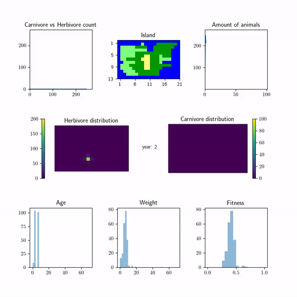

.. BioSim documentation master file, created by
   sphinx-quickstart on Sun Jan 16 02:19:17 2022.
   You can adapt this file completely to your liking, but it should at least
   contain the root `toctree` directive.

Welcome to BioSim's documentation
==================================

BioSim is a Python package developed for creating and visualizing agent-based simulations of island ecosystems
consisting of various landscape and fauna.

The package was originally made to simulate the ecosystem of the fictional island of Rossumoya, yet it
allows for the simulation of island ecosystems with different configurations of landscape and fauna
through the user interface in the :class:`BioSim` class.

.. toctree::
   :maxdepth: 2
   :caption: Contents:

   Introduction
   usage
   modules

Indices and Tables
==================

* :ref:`genindex`
* :ref:`modindex`
* :ref:`search`
